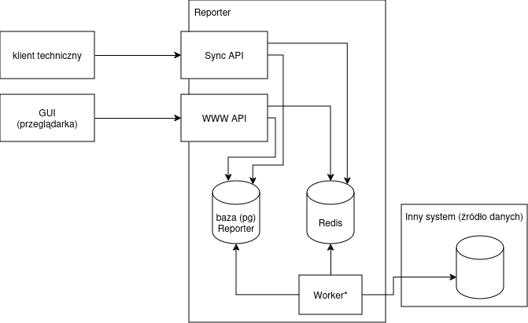
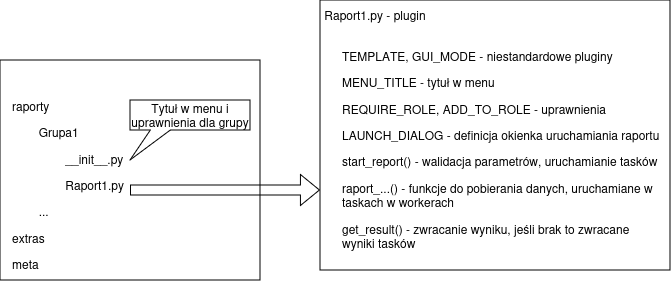

# Dokumentacja techniczna

## Opis systemu

Aplikacja Alab Reporter służy do łatwego definiowania raportów wykonywanych z różnych baz danych, zarządzania dostępami
do raportów i efektywnego wykonywania raportów przez użytkowników końcowych. Raporty wykonywane są wg parametrów
podawanych i walidowanych przez łatwo definiowalny formularz, a na bazach danych wykonywane są za pomocą kolejek
zapewniających z jednej strony równoległe wykonywanie zapytań na wielu bazach jeśli jest to możliwe, z drugiej
zapewniających że bazy laboratoryjne nie są obciążane wykonywanymi raportami w sposób nieograniczony.
Ze względu na łatwość rozbudowy i dostępy do aplikacji wielu użytkowników firmy Reporter służy także do tworzenia
prostych narzędzi, dla których interfejs wejścia/wyjścia zapewniany przez Reportera jest wystarczający do danego
zadania, dłużej trwające zadania mogą być wykonane w kolejce, mamy możliwość zarządzania dostępami i logowania
działań użytkowników. Jest to dobra alternatywa dla tworzenia samodzielnych aplikacji do prostych zadań.

Na aplikację składają się:

* Interfejs użytkownika w formie SPA komunikującego się z backendem
* Część serwerowa stanowiąca bezpośredni backend dla interfejsu użytkownika (uprawnienia, wystawianie drzewa raportów
  i definicji formularzy, startowanie raportów i przekazywanie wyników)
* Część serwerowa stanowiąca procesy robocze do obsługi dłużej trwających zadań (np wykonywanie raportów na bazach
  danych)
* Pozostałe części serwerowe - szczegółówo rozpisane w dalszej części dokumentu

Wszystkie części serwerowe pracują na wspólnym kodzie.

## Architektura systemu

Podstawową zasadą działania aplikacji Alab Reporter jest wydzielenie wykonywania właściwej (często długotrwałej) części
raportów za pomocą działających w tle (względem głównej aplikacji) workerów, wykonujących zakolejkowane zadania.
Zapewnia to:

* Ograniczenie ilości zapytań (zwłaszcza ciężkich) działających naraz na pojedynczej bazie
* Równoległe wykonywanie zapytań na wielu bazach, np w przypadku raportów ze wszystkich laboratoriów
* Możliwość priorytetyzacji zadań (krótkie zadania do raportów wykonywanych często i szybko mogą być wykonywane
  w oddzielnej kolejce od cięższych zapytań i na nie nie czekać)
* Skalowalność aplikacji (z uwzględnieniem zakładanych ograniczeń)



Patrząc od strony kodu źródłowego aplikacja ma architekturę wtyczkową. Na core aplikacji składają się:

* api - API webowe przede wszystkim dla GUI
* api_sync - API dla klientów technicznych
* cron - mechanizmy do cyklicznego wykonywania zadań
* datasources - dostępy do różnych źrodeł danych w formie baz danych i innych. Źródła bazodanowe poza formą ogólną
  (np Firebird, PostgreSQL, MSSQL, ...) mogą mieć też klasy dla konkretnych aplikacji (np Centrum, SNR, z powtarzalnymi
  metodami do zbierania danych). Patrząc na możliwość łatwego dodawania nowych typów źródeł danych można je także
  traktować jako wtyczki
* dialog - klasy bazowe dla definicji formularzy do uruchamiania raportów
* helpers - różne funkcje pomocnicze nie pasujące do innych modułów
* outlib - klasy do zwracania wyników działania raportów w różnych formatach
* tasks - mechanizmy wykonywania czasochłonnej części raportów w zadaniach, za pomocą bilioteki rq i kolejek w Redisie
* templates - szablony dla standardowych formatów raportów minimalizujące jeszcze bardziej nakład pracy nad stworzeniem
  raportu (obecnie - tworzenie raportów typu "eksport z Centrum")
* plugins.py - mechanizmy obsługi wtyczek (inicjalizacja, podpinanie pod menu, uprawnienia)

W następujących katalogach znajdują się raporty i inne narzędzia stanowiące wtyczki do narzędzia Reporter:

* extras - miejsce na pluginy korzystające z mechanizmów Reportera, ale niepodpinane pod GUI (menu)
* meta - narzędzia do zarządzania i podglądu stanu pracy samego Reportera, "moje raporty", widoczne w menu
* raporty - właściwe raporty i inne narzędzia widoczne w menu, wg uprawnień

Struktura pakietów i modułów pythonowych w katalogach meta i raporty mapuje się bezpośrednio na narzędzia dostępne
w menu aplikacji. Wtyczka zawiera elementy konieczne do umieszczenia raportu w menu, uruchomienia raportu (definicja
formularza, funkcja startująca uruchamiająca taski w tle), funkcje uruchamiane jako taski w tle i opcjonalnie funkcję
do całościowego zbierania wyniku działania raportu z wyników funkcji-tasków. Szczegółówy opis interfejsu wtyczki
w dalszej części dokumentu.



W chwili obecnej cała część frontendowa aplikacji stanowi część core'ową, tzn nie ma możliwości definiowania
i dokładania customowych elementów interfejsu dla pojedynczych raportów. Do tej pory nie stanowiło to problemu,
brakujące funkcjonalności frontendowe były dodawane tak, aby były możliwie ogólne.

## Rozwiązania techniczne

### Źródła

Żródła zarówno backendu jak i frontendu znajdują się w Gitlabie w repozytorium
http://gitlab.alab.lab/adam.morawski/reporter

### Dokumentacja

Poza niniejszą dokumentacją zawsze aktualne opisy raportów oraz ich dostępność dla użytkowników są dostępne w samej
aplikacji Alab Reporter:

* opisy raportów - przy raportach
* dostępy do raportów dla ról użytkowników - Administracja -> Uprawnienia
* zawieranie się w sobie uprawnień wynikających z ról - Administracja -> Role użytkowników

### Stack

#### Backend

* Python 3.7.3
    * Flask 2.1.2 + FlaskRESTx
    * uWSGI 2.0.20
    * rq 1.10.1
    * cryptography 3.4.8, PyJWT 2.4.0
    * dostęp do baz danych: psycopg2, fdb, mysql-connector, pymssql, redis
    * formaty dokumentów: PyPDF2, Weasyprint, openpyxl, ezodf, python-docx

#### Frontend

* React 16.13
    * BlueprintJS 3
    * formik 1.5

### Hosting

Aplikacja jest hostowana na maszynie reporter.alab.lab (10.1.1.181, 2.0.205.117) w kolokacji Zawodzie.
Maszyna działa na systemie Linux Debian 10. Działanie aplikacji wymaga następujących usług działających w systemie:

* Postgresql - serwer bazy danych, ustawienia w /etc/postgresql/13/main/
* Redis - serwer kolejek dla zadań utrzymywanych w tle (obsługiwany przez bibliotekę rq) + chwilowe statusy i cache
* Supervisord - utrzymuje uruchomione procesy backendu
* Screen - procesy workerów uruchamiane są na screenach użytkownika centrum-system (nie jest to podpięte pod supervisora
  ze względu na to, że lista workerów zmienia się wraz z listą laboratoriów)

#### Cron

Z crona użytkownika centrum-system uruchamiane są następujące skrypty mniej lub bardziej związane z systemem

| Harmonogram                               | Polecenie                                               | Opis                                                                                                                                                                                               |
|-------------------------------------------|---------------------------------------------------------|----------------------------------------------------------------------------------------------------------------------------------------------------------------------------------------------------|
| 1,6,11,16,21,26,31,36,41,46,51,56 * * * * | /home/centrum-system/bin/reporter_cron                  | Uruchomienie wewnętrznego crona Reportera (wg konfiguracji w bazie). Skrypt nie czeka na wykonanie zadań - uruchamia je w workerach oraz zapisuje wyniki jeśli uruchomione wcześniej się skończyły | 
| 45 0 * * * <br>05 6 * * *                 | /home/centrum-system/bin/odswiez_konfiguracje_reportera | Aktualizacja konfiguracji reportera na podstawie snr (laboratoria) i restart workerów                                                                                                              | 
| 0 1 * * *<br>0 5 * * *<br>30 19 * * *     | /home/centrum-system/bin/nocka_sync                     | Zgrywanie danych z laboratoriów do bazy "nocka"                                                                                                                                                    |
| 30 5 * * *                                | /home/centrum-system/bin/nocka_metody_normy             | Pobieranie metod i norm z baz laboratoryjnych, używanych dalej przez BiC                                                                                                                           | 
| 30 7 * * *                                | /home/centrum-system/bin/raport_nocka_sync              | Raport z problemów z uzupełnianiem bazy "nocka"                                                                                                                                                    |
| 30 21 * * *                               | /home/centrum-system/bin/bizon                          | Pobieranie słowników RPWDL i EWP i aktualizacja w naszej bazie rpwdl                                                                                                                               |
| 20 15 * * 7                               | /home/centrum-system/bin/nowe_lecznicze                 | Raport do dyrektorów regionalnych z informacjami o nowych podmiotach i zakładach leczniczych w RPWDL                                                                                               |
| 45 6,8,10,12,14,16 * * *                  | /home/centrum-system/bin/uzupelnij_kody_do_weryfikacji  | Uzupełnienie informacji o kodach do weryfikacji (widoczne w raportach Kody do weryfikacji i Szukaj kodu)                                                                                           |
| 54 8 * * *                                | /home/centrum-system/bin/reporter_dzienna_sprzedaz      | Uzupełnienie tabeli do raportów z dziennej sprzedaży w bazie "nocka"                                                                                                                               |
| 11 * * * *                                | /home/centrum-system/bin/listy_robocze_sync             | Pobieranie informacji z baz laboratoryjnych o bieżących listach roboczych do bazy nocka. Dane widoczne w raporcie "Szukaj Kodu"                                                                    |
| 0 18 * * *                                | /home/centrum-system/bin/snrkonf_nocka_sync             | synchronizacja płatników, badań i cen z SNR do nocki                                                                                                                                               |
| 15 22 3-15 * *                            | /home/centrum-system/bin/raport_gotowka                 | Raporty ze zleceń gotówkowych dla zleceniodawców prowizyjnych, dla działu rozliczeń                                                                                                                | 
|                                           |                                                         |                                                                                                                                                                                                    | 

### Integracje

Poniżej opisane są integracje aplikacji Alab Reporter z innymi systemami, z pominięciem systemów, do których baz łączą
się poszczególne raporty.

#### Konfiguracja laboratoriów z SNR

#### Zasilanie bazy raportowej "nocka"

### Baza danych

### Wtyczki

Wtyczki w katalogach extras, meta i raporty tworzą struktury katalogów i pakietów pythonowych, które następnie mogą być
mapowane na menu widoczne w GUI dla użytkowników. Dla katalogu (grupy raportów lub pojedynczego bardziej złożonego
raportu) miejscem odpowiednich definicji jest plik \_\_init\_\_.py, dla wtyczek w formie pojedynczych plików - sam plik.
Dla każdego miejsca mogącego mieć odwzorowanie w menu (i grupa wtyczek i pojedyncza wtyczka) możliwa jest definicja
następujących pól:

| Nazwa        | Typ             | Opis                                                                                                                                                                                   | 
|--------------|-----------------|----------------------------------------------------------------------------------------------------------------------------------------------------------------------------------------| 
| MENU_ENTRY   | Optional\[str\] | Tytuł w menu lub None jeśli ma nie być widoczne w menu                                                                                                                                 | 
| REQUIRE_ROLE | List\[str\]     | Lista uprawnień, z których użytkownik musi posiadać co najmniej jedno, aby widzieć dany raport lub grupę i wszystkie elementy poniżej, o ile nie mają zdefiniowanych inaczej uprawnień | 
| ADD_TO_ROLE  | List\[str\]     | j.w., ale pozwala dodać pojedynczy element do wskazanej roli nawet jeśli cała gałąź została wykluczona wyżej za pomocą REQUIRE_ROLE                                                    |

Wtyczki stanowiące samodzielne raporty/narzędzia mogą definiować następujące elementy:

| Nazwa                | Typ                       | Opis                                                                                                                                                                                                                                                                                                              | 
|----------------------|---------------------------|-------------------------------------------------------------------------------------------------------------------------------------------------------------------------------------------------------------------------------------------------------------------------------------------------------------------| 
| LAUNCH_DIALOG        | dialog.Dialog             | Definicja formularza służącego do uruchamiania raportu                                                                                                                                                                                                                                                            |
| init_plugin()        | funckcja                  | Funkcja uruchamiana jednorazowo po załadowaniu modułu przez PluginManagera (raz na załadowanie aplikacji WWW i przed uruchomieniem raportu z workera). Może służyć do jednorazowej inicjalizacji struktur danych.                                                                                                 |
| start_report(params) | funkcja                   | funkcja służąca do walidacji danych z formularza startowego (błąd walidacji sygnalizowany może być wyjątkiem ValidationError) i tworząca i zwracająca TaskGroup z taskami do uruchomienia                                                                                                                         |
| get_result(ident)    | funkcja                   | opcjonalna funkcja mogąca zbierać wyniki wszystkich tasków i zwracać wynik dla użytkownika w postaci przetworzonej. Funkcja jest wywoływana wielokrotnie dla długich zadań, nie tylko po zakończeniu wszystkich podzadań. Jeśli tej funkcji nie ma to zwracane są wszystkie niepuste wyniki uruchomionych tasków. |
| GUI_MODE             | str                       | Jeśli obecne to inny niż standardowy widok po stronie GUI, opis dalej                                                                                                                                                                                                                                             |
| submenu_for_user()   | funkcja                   | Możliwość generowania wyliczanego podmenu dla pojedynczego raportu                                                                                                                                                                                                                                                |
| NEWS                 | list\[tuple\[str, str\]\] | Lista nowości (zmian w raporcie) do wyświetlania użytkownikom. Każdy wpis w postaci ```("YYYY-MM-DD", "Treść komunikatu w markdown")```. Wpisy są widoczne na wierzchu przez miesiąc od podanej daty, potem schowane pod przyciskiem.                                                                             |

Dodatkowo w każdej wtyczce po jej inicjalizacji dostępna jest specjalna wartość \_\_PLUGIN\_\_ zawierająca ścieżkę do
pluginu w postaci odpowiadającej importom pythonowym (grupa1.grupa2.plugin). Wartość ta jest potrzebna m.in. do
uruchamiania grup zadań, aby worker następnie załadował do wykonania ten sam plugin.

Dla każdego raportu może istnieć oddzielny plik z dokumentacją w formacie markdown, w pliku o nazwie takiej samej jak
moduł wtyczki i rozszerzeniu md. Dokumentacja jest wyświetlana użytkownikom obok formularza uruchamiającego raport
oraz służy do generowania dokumentacji w formacie PDF.

#### GUI_MODE

Domyślnym sposobem prezentacji wtyczki w GUI jest wyświetlenie formularza uruchamiania raportu (LAUNCH_DIALOG), a po
jego zatwierdzeniu (przycisk Generuj itp) uruchamiana jest funkcja start_report(), którą można zwalidować dane
z formularza i uruchomić dalsze zadania. Wynik działania uruchomionych zadań jest zwracany przez funkcję get_result()
(jeśli jest) lub jako zbiorczy wynik wszystkich tasków (raporty.common.generic_get_result). Funkcja zwraca też progress
z przedziału 0-1 wyświetlany jako pasek postępu. Wartość 1 oznacza zakończenie wykonywania raportu. Za pomocą
opcjonalnego ustawienia GUI_MODE możliwa jest zmiana trybu działania danej wtyczki:

| Wartość       | Opis                                                                                                                                                                                                                                                                              |
|---------------|-----------------------------------------------------------------------------------------------------------------------------------------------------------------------------------------------------------------------------------------------------------------------------------|
| one_shot      | Brak formularza uruchamiania raportu, od razu po otwarciu uruchamiana jest funkcja get_content() zwracająca dane w takiej samej postaci jak get_result() w zwykłych raportach. Funkcja uruchamiana jest w wątku obsługi żądania API, a nie w tle, więc nie może być czasochłonna. |
| settings      | Widok tabelki z ustawieniami, tu użyty (i mocno dostosowany) do zarządzania użytkownikami i uprawnieniami                                                                                                                                                                         |
| mailing       | Podobny do powyższego widok ustawień dla raportów mailowych (niedokończone podejście do zmiany sposobu takich raportów obecnie konfigurowanych w plikach)                                                                                                                         |
| saved_reports | Widok do pojedynczego użycia w menu "Moje -> Raporty"                                                                                                                                                                                                                             | 

#### Formularz uruchamiania raportu - komponenty dialog

#### Klasa TaskGroup

#### Wyniki raportów zwracane do interfejsu użytkownika

### Konfiguracja

TODO opisać konfigurację crona w bazie danych

### Logi

Zmiany w konfiguracji aplikacji (przede wszystkim uprawnienia, teoretycznie też zmiany w innych raportach
konfigurowanych z Reportera) są logowane w bazie danych w tabeli log_zmiany.
Uruchomienia raportów przez użytkowników (wraz z parametrami) i ew. inne zdarzenia customowe dla konkretnych
raportów/narzędzi są logowane w tabeli log_zdarzenia.
Błędy występujące podczas pracy aplikacji, przede wszystkim problemy z dostępami do zdalnych baz są logowane do Sentry.
Dostępy do API są odnotowywane w logach serwera Nginx.

### Dostęp

### Troubleshooting

### Testy

### Opiekunowie projektu


